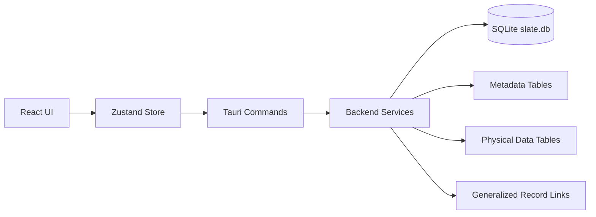

# Slate

**Slate** is a local-first desktop workspace for structured personal data.
Think of it as a stack of spreadsheets with a real SQLite engine underneath.

It is intentionally:
- single-user
- offline/local-first
- metadata-driven
- extensible without becoming bloated

Slate is built for personal knowledge/data workflows like contacts, notes, projects, and ideas.

## Why Slate

Most tools are either:
- too simple (notes with weak structure), or
- too heavy (cloud-first, team-first systems)

Slate sits in the middle:
- spreadsheet-like editing speed
- relational storage integrity
- polished desktop UX
- no auth, no cloud, no account overhead

## Current MVP Status

Implemented today:
- [x] Dark-themed 3-panel workspace + top bar
- [x] Sidebar table list
- [x] Create / rename / delete tables
- [x] Create / rename / delete columns
- [x] Field types: `text`, `long_text`, `date`, `checkbox`
- [x] Editable grid cells
- [x] Add / edit / delete records
- [x] Row selection + detail panel editing
- [x] Search within current table
- [x] SQLite metadata layer (`app_tables`, `app_fields`, etc.)
- [x] Generalized cross-table link architecture (`record_links`)
- [x] First-launch starter tables (Contacts, Notes, Projects, Ideas)
- [x] Backend tests for init + CRUD + search + links

## Stack

- **Desktop shell:** Tauri 2
- **Frontend:** React + TypeScript + Vite
- **State:** Zustand
- **Icons:** Lucide
- **Database:** SQLite (`rusqlite`, bundled)

## Quick Start

### Prerequisites

- Node.js 20+
- npm 10+
- Rust toolchain (`rustup`, `cargo`, `rustc`)

If Rust was just installed, open a new shell (or run `source $HOME/.cargo/env`).

### Install

```bash
npm install
```

### Run (desktop app)

```bash
npm run tauri -- dev
```

### Build frontend bundle

```bash
npm run build
```

### Run backend tests

```bash
source $HOME/.cargo/env
cargo test --manifest-path src-tauri/Cargo.toml
```

## Product Shape

Slate follows this layout:

```text
+--------------------------------------------------------------------------------------+
| Slate                     [ Search current table... ]          [+ Record] [+ Table] |
+----------------------+------------------------------------------------+--------------+
| Tables               | Main Grid / Table View                         | Record       |
| Contacts             |                                                | Detail Panel |
| Notes                |                                                |              |
| Projects             |                                                |              |
| Ideas                |                                                |              |
+----------------------+------------------------------------------------+--------------+
```

## Architecture Overview



## Data Model

Slate uses an application metadata layer so the UI is not coupled to raw SQL introspection.

### Metadata tables
- `app_meta`: workspace/app-level metadata
- `app_tables`: logical tables (display name, storage name, primary field)
- `app_fields`: field definitions (type, order, visibility)
- `app_views`: reserved for future view metadata

### Relationship model (future-proof)
- `record_links`: generalized many-to-many links between any records in any tables
  - `from_table_id`, `from_record_id`
  - `to_table_id`, `to_record_id`
  - `link_type`, `metadata_json`

### Physical storage strategy
Each logical table maps to a physical SQLite table (`data_<id>`) containing:
- `record_id` (stable key)
- `created_at`
- `updated_at`
- one column per app field (`column_key`)

This keeps query/write performance straightforward while preserving flexible metadata-driven UI behavior.

## Repository Structure

```text
slate/
  docs/
    SLATE_MVP_PLAN.md
    DEVELOPMENT_LOG.md
  src/                # React frontend
  src-tauri/          # Rust backend + SQLite + Tauri config
```

## Backend Service Layers

- `db::init` - database initialization + starter seed
- `schema_service` - physical schema operations
- `metadata_service` - table/field metadata reads
- `table_service` - table + field mutations
- `record_service` - row CRUD
- `search_service` - current-table search clauses
- `link_service` - generalized record-link operations (placeholder surface for future UI)

## Design Direction

Slate UI targets:
- serious, minimal dark interface
- restrained blue/purple accenting
- fast text-heavy editing comfort
- clear hierarchy without dashboard clutter

Primary palette:
- `#0B0F19` background
- `#121826` panel
- `#1A2236` elevated
- `#3B82F6` primary accent
- `#8B5CF6` secondary accent

## What Is Deliberately Out of Scope

- authentication / user accounts
- permissions / roles
- collaboration
- cloud sync
- formula engine
- automation engine

Slate is intentionally a local personal workspace.

## Near-Term Roadmap

1. Persisted view configs (`app_views`) + basic saved filters/sorts
2. Dedicated column-management UX (fewer prompt dialogs)
3. Relationship UI powered by existing `record_links`
4. Better keyboard navigation and bulk-edit ergonomics
5. Import/export workflows (CSV and backup/restore)

## Planning + Development Notes

- Technical architecture and implementation phases: `docs/SLATE_MVP_PLAN.md`
- Session-by-session implementation log: `docs/DEVELOPMENT_LOG.md`

## License

This repository uses the [GNU General Public License v3.0](./LICENSE).
